# School TimeTable Management System
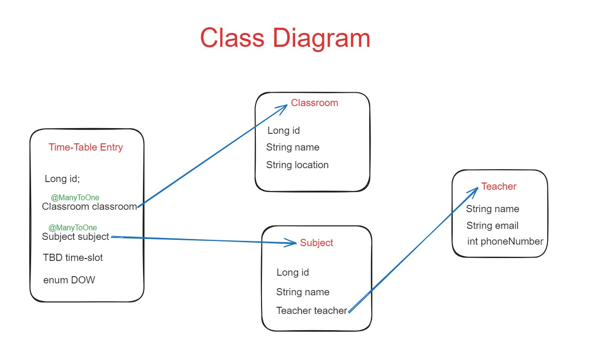

## Requirements
- [x] Class Design
- [X] Classroom Model
- [x] CRUD Operations for Classroom
- [x] Feature to list all timetable entries for a specific classroom.
- [x] Subject Model
- [x] Implement functionalities to assign subjects to specific time slots in the timetable.
- [x] Support listing all timetable entries for a specific subject.
- [x] TimeTableEntry Model
- [x] CRUD operations for TimeTable
- [x] Adding logging for each CRUD operation

### Model Creations for Classroom, Subject, Teacher, TimeTableEntry
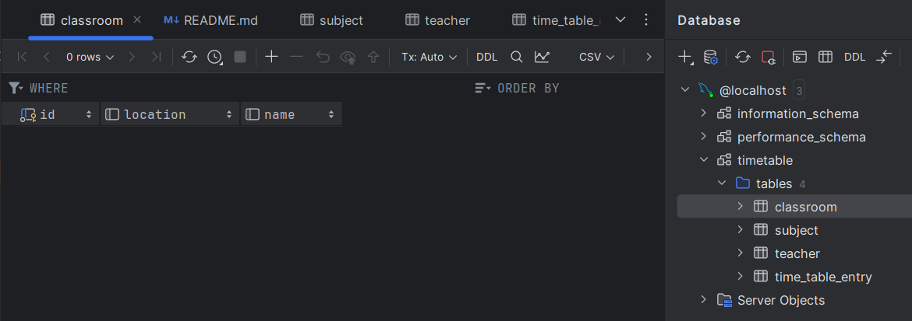
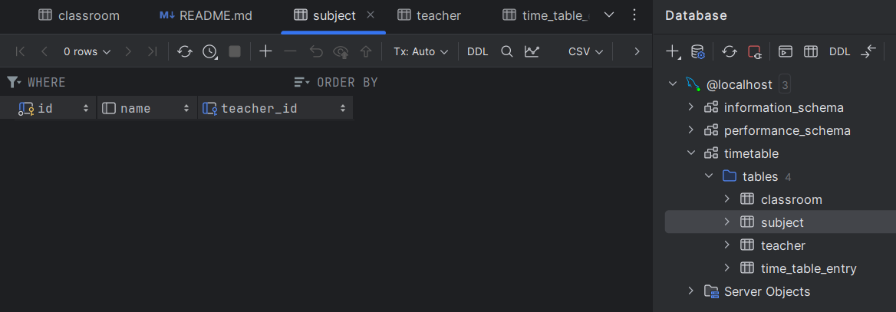
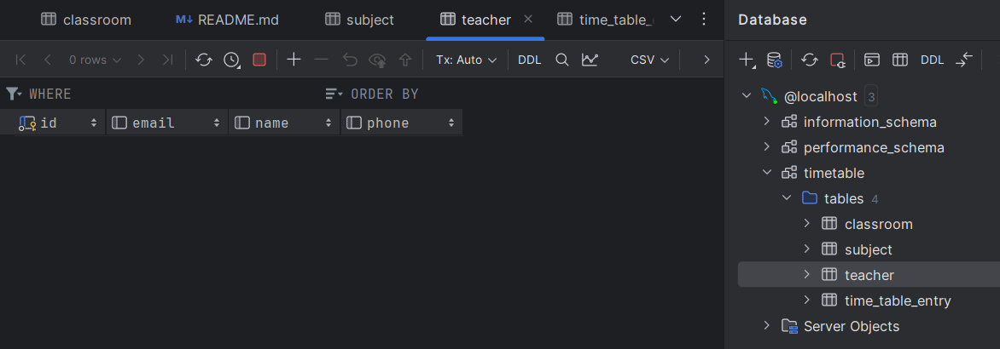
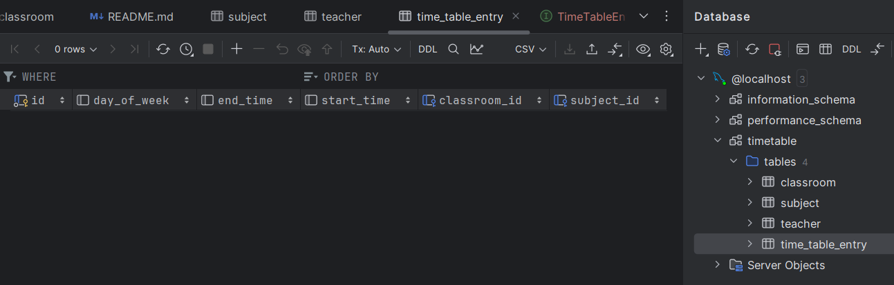

### CRUD Operations for Classroom

#### Create Classroom
##### http://localhost:8080/classroom/create
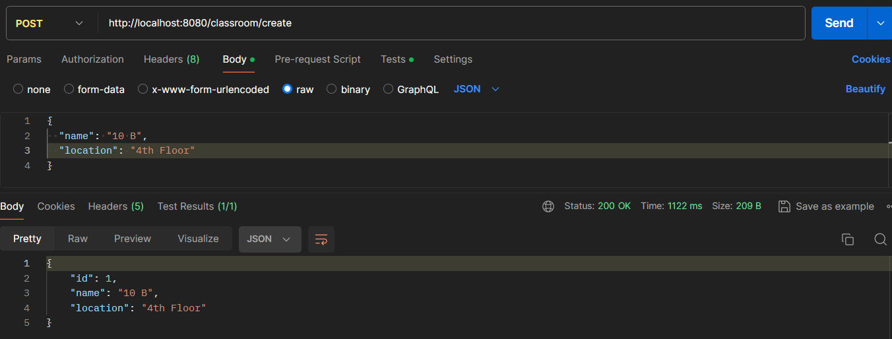
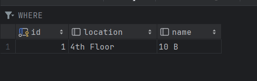

#### Read Classroom
##### http://localhost:8080/classroom/1
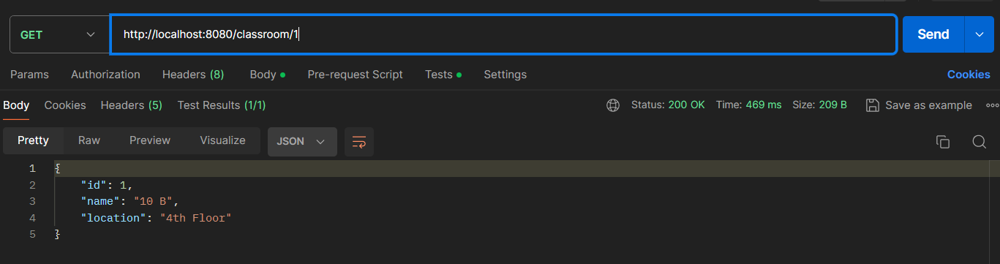

#### Update Classroom
##### http://localhost:8080/classroom/update
###### Before Update
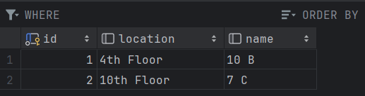
###### After Update
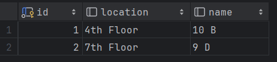
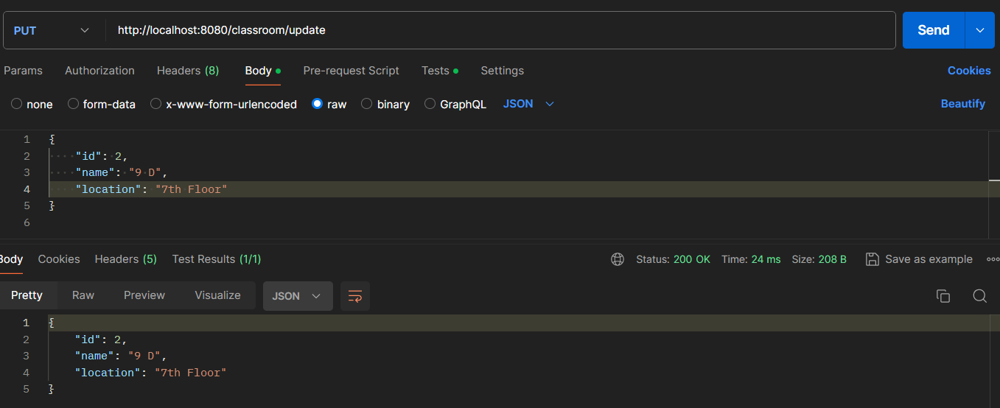

#### Delete Classroom
###### Before Delete
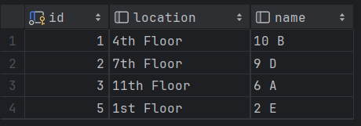
###### After Delete
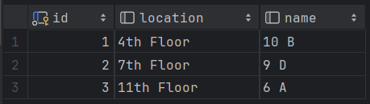

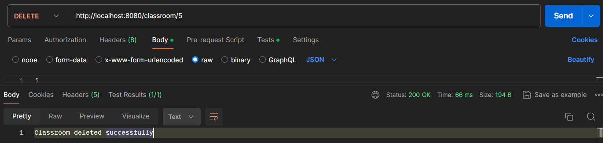

### CRUD Operations on TimeTableEntry
#### Create TimeTable
##### http://localhost:8080/timetableEntry/create
###### input json
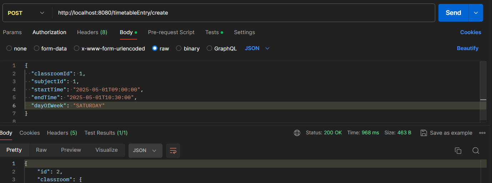
###### output json
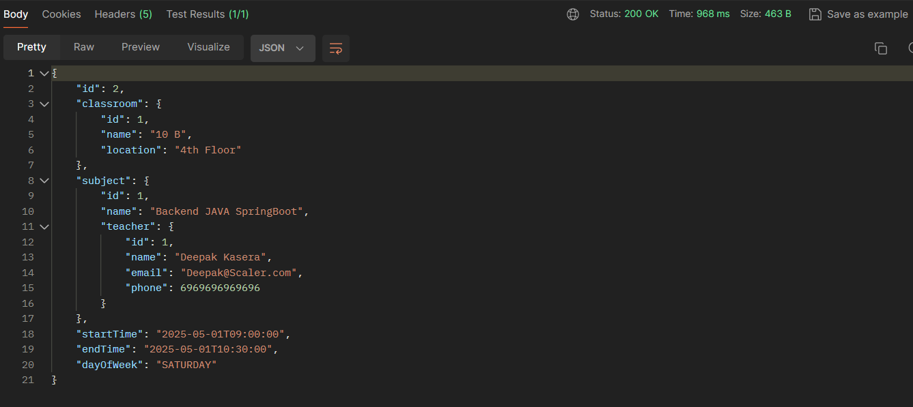
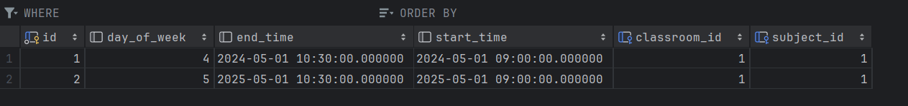

#### Read TimeTable by ID

#### Update TimeTable
##### http://localhost:8080/timetableEntry/update
###### Before Update
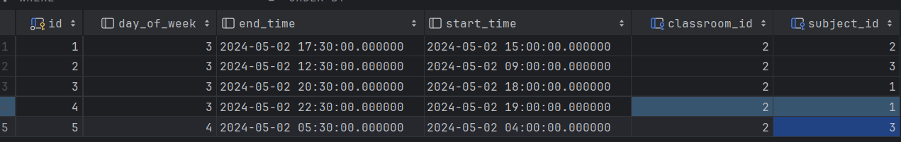
###### After Update

#### Delete TimeTableEntry
###### http://localhost:8080/timetableEntry/3
##### Before Delete
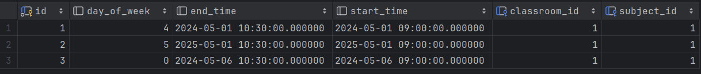
##### After Delete
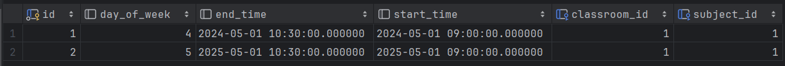
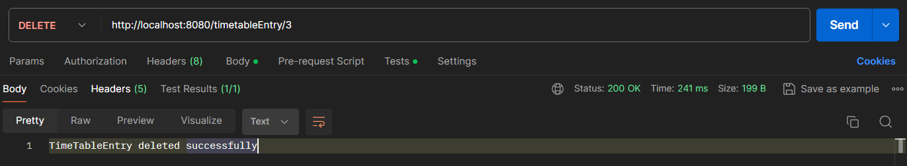

### Operations on Teacher and Subject

#### Create Teacher 
##### http://localhost:8080/teacher/create
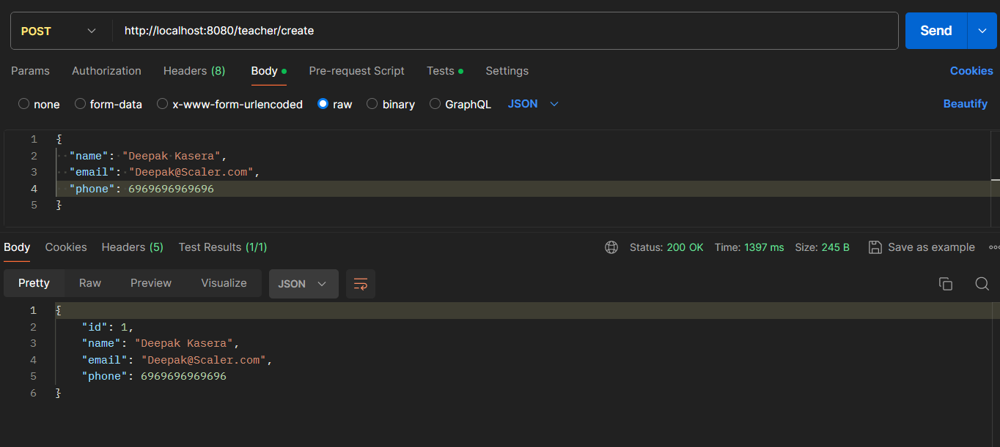
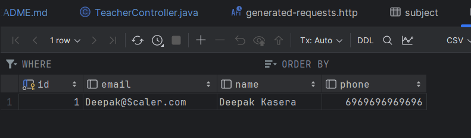

#### Create Subject
##### http://localhost:8080/subject/create
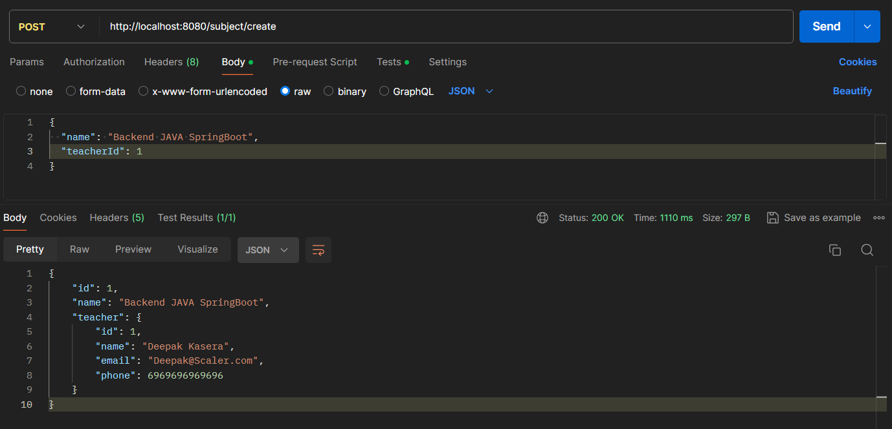
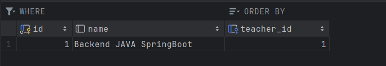

### Other Functionalities
#### Get All TimeTables related to a particular Classroom using Classroom ID 
##### http://localhost:8080/classroom/timetables/1
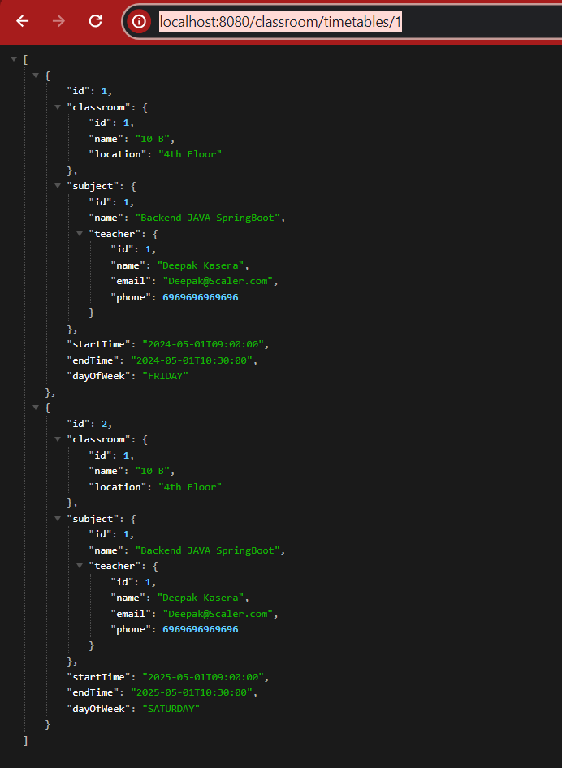

#### Get all TimeTableEntries linked to a specific Subject by SubjectID
##### http://localhost:8080/subject/timetables/1
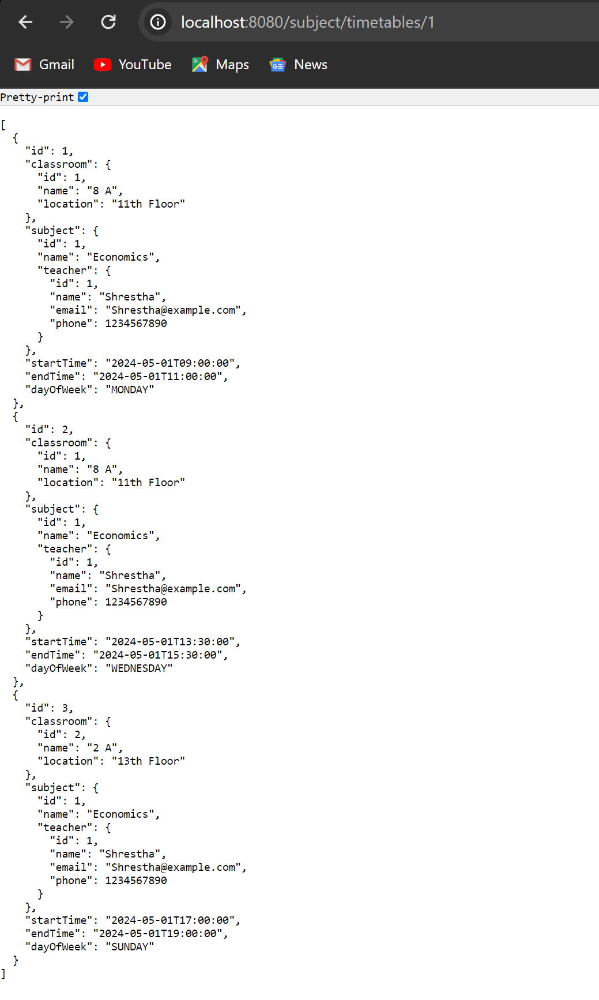

#### TimeTable Subject Updation
##### http://localhost:8080/timetableEntry/assignSubjectToTimeSlot/2/2
###### Before Update
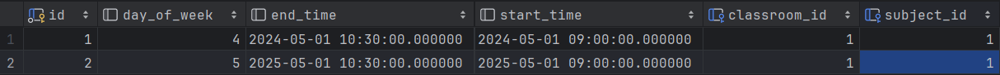
###### After Update
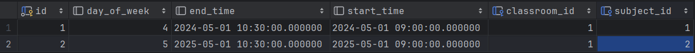
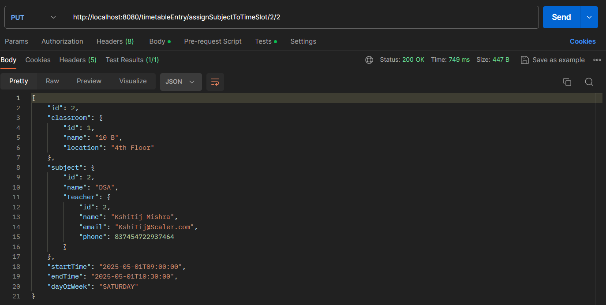

### Authorisation of Admin
- Credential (Userid, password) Through URL
 
But our URL will became too long (BAD PRACTICE). As many browsers have some limit on the length of the URL.
- Credential (Userid, password) Through Request Body (JSON)
 
In the request body, apart from the actual data, the user will also send the credentials. This is a better approach as the URL will not be too long and the credentials will be sent in the request body.
- JWT Token (JSON Web Token)

### Logging Functionality
#### Workflow of Logging
- We have used SLF4J (Simple Logging Facade for Java)library for logging.
- In every controller we are creating a logger object.
- We are using this logger object to log the information.
- We are logging the information in the console.
- We are also logging the information in the file.
- We are using logback.xml file to configure the logging to remove the unwanted logs. [Future Implementation]

#### Before Logging
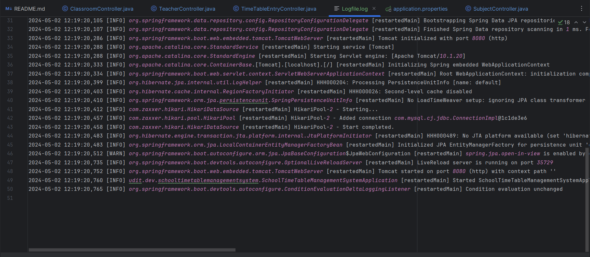
#### After Logging
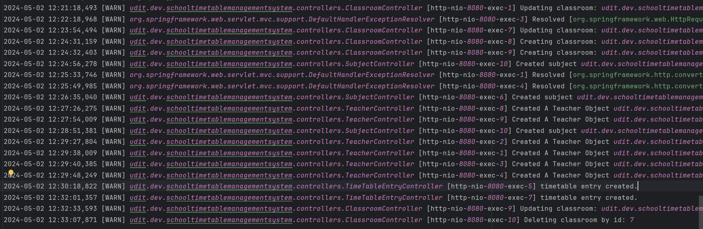

